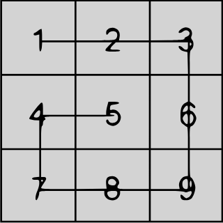
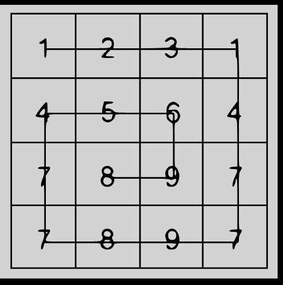

# Snail Sort — 4 kyu

## Description

Given an `n x n` array, return the array elements arranged from outermost elements to the middle element, traveling clockwise.

```
array = [[1,2,3],
         [4,5,6],
         [7,8,9]]
snail(array) => [1,2,3,6,9,8,7,4,5]
```

For better understanding, follow the numbers of the next array consecutively:

```
array = [[1,2,3],
         [8,9,4],
         [7,6,5]]
snail(array) => [1,2,3,4,5,6,7,8,9]
```

> **NOTE:** The idea is not to sort the elements from lowest to highest — the idea is to traverse the 2D array in a clockwise snail-shell pattern.  
> **NOTE 2:** The 0x0 (empty matrix) is represented as an empty array inside an array `[[]]`.

## Visual Reference

### 3x3 Matrix


### 4x4 Matrix


## Traversal Pattern

```
→ → → ↓
↑ → ↓ ↓
↑ ↓ ← ↓
↑ ← ← ←
```

Direction order: right → down → left → up, repeat shrinking inward each cycle.

## Prototype (C)

```c
#include <stdlib.h>
int *snail(size_t *outsz, const int **mx, size_t rows, size_t cols);
// Returns a heap-allocated array with elements in snail order
// Reports the size in *outsz
```

## Examples

| Input | Output |
|-------|--------|
| `[[1,2,3],[4,5,6],[7,8,9]]` | `[1,2,3,6,9,8,7,4,5]` |
| `[[1,2,3],[8,9,4],[7,6,5]]` | `[1,2,3,4,5,6,7,8,9]` |
| `[[1,2,3,1],[4,5,6,4],[7,8,9,7],[7,8,9,7]]` | `[1,2,3,1,4,7,7,9,8,7,7,4,5,6,9,8]` |
| `[[]]` | `[]` |

## How to Test Locally

```bash
gcc -g -Wall -Wextra solution.c test.c -lcriterion -o test && ./test
```

```bash
Time: 634ms Passed: 2Failed: 0
Test Results:
Generic_Test
should_return_the_snail
Test Passed
Completed in 0.7696ms
Completed in 0.7696ms
Random_Test
should_return_the_uncheated_snail
Test Passed
Completed in 23.5294ms
Completed in 23.5294ms
You have passed all of the tests! :) 
```